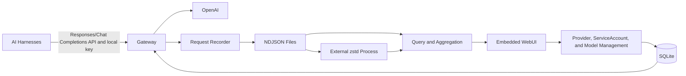

# Gyemoim: Local LLM Gateway

Status: Current system specification.

## Purpose

Gyemoim is a local LLM gateway that centralizes provider authentication and records requests from multiple AI harnesses. Users connect provider accounts through a WebUI, then configure their harnesses to send inference requests through the gateway.

The service has four primary goals:

1. Authenticate with providers once instead of authenticating each harness separately.
2. Attribute requests and token usage to individual harnesses, and investigate context growth, repeated inputs, and prompt cache misses.
3. Provide evidence for debugging provider latency, gateway delays, and harness behavior.
4. Preserve request history as data for analyzing the user's usage patterns.

## System Summary

- Implement the service in Go and support Linux and macOS.
- Ship a single executable with an embedded WebUI.
- Start with no configuration file or database setup required.
- Listen on `127.0.0.1:9092` by default; `--listen` sets the bind address and `--port` remains a port-only alias (`--listen` wins when both are given).
- Expose the OpenAI Responses API format to harnesses, plus the Chat Completions format served by translation to the Responses upstream.
- Use Sign in with ChatGPT for OpenAI provider authentication; pi agent setup is documented in [pi.md](pi.md), and request-compatibility rules in [harness-compatibility.md](harness-compatibility.md).
- Manage three user-facing concepts in the WebUI: Provider, ServiceAccount, and Model.
- Issue local API keys to ServiceAccounts used by harnesses. Provider authentication remains centralized.
- Let users assign Model names and connect each Model to one Provider and one upstream model. Only single-target selection is implemented, behind a Go strategy interface.
- Permit only explicitly assigned Models for each ServiceAccount. Newly created Models require an explicit grant; there is no all-Models permission.
- Record prompts, responses, tool definitions, and tool results by default, excluding authentication credentials.
- Block new inference requests when request recording is unavailable; do not offer an unlogged bypass.
- Store configuration and credentials in SQLite; store request history in NDJSON files.
- Rotate logs and compress closed files by spawning the external `zstd` executable.
- Retain request history indefinitely. Provide storage visibility and deletion of all request records in a selected date range; ServiceAccount- or Model-specific deletion is not offered.

## Web Deployment

Gyemoim runs either as a local tool (loopback WebUI, no ceremony) or as an always-on web service behind a reverse nginx proxy reachable by remote agents. Full rationale, schema, and deployment recipes: [web-deployment.md](web-deployment.md).

- Multi-user session login for the management UI: 24 h absolute sessions, argon2id password hashing, first-start bootstrap `admin` with a one-time password on stderr and forced change.
- There is no browser-facing web security layer: no CSRF token, no Origin/Sec-Fetch-Site checks, and no security header set. Plain-HTTP LAN access is the primary usage mode, so the session cookie is the plain `gym_session` (`HttpOnly; SameSite=Lax; Path=/`). Residual risk: a malicious page in the same browser can drive mutations; `SameSite=Lax` on the session cookie retains baseline cross-site POST protection, and the auth value is still required for every action.
- URLs are derived from each request; forwarded headers (`X-Forwarded-*`) are never trusted. The OAuth redirect URI stays the hardcoded loopback form, and the pi-config base URL is built client-side from `window.location.origin`; the server derives no public URLs.
- ChatGPT credential transfer for headless servers via a server-distributed Python enrollment script: OpenAI accepts only loopback redirect URIs, so the script runs on a browser machine and the server keeps owning registration, PKCE, exchange, ID-token verification, and refreshes, using its own host ID.

## Web UI

- **Hash routing.** The SPA routes by URL hash (`#/overview` … `#/users`, unknown → `#/overview`, parameters in the hash query); every page sets `document.title` and works with Back/Forward/reload/bookmarks.
- **Module split.** Vanilla-JS ES modules under `assets/js/` (state, dom, format, api, errors, feedback, nav, one module per page, `app.js` entry) with relative imports; no bundler.
- **Error humanization.** A shared mapping module translates a small set of known generic/conflict responses (duplicate-name 409s, JSON-field leaks) into labeled, actionable sentences; server messages that are already specific pass through verbatim. Never auto-retry, never mask.
- **Feedback standard.** Every mutating action ends in one inline success message that names the consequence, or a card/row update with a scroll-and-highlight; messages clear on input; loading states disable their buttons; load feedback is an "Updated HH:MM:SS UTC" stamp.
- **Cross-page links.** Empty states and next-step prose that reference another page link to it (`navigate(page, params)`).
- **UTC policy.** Timestamps display with explicit UTC; time-range filters take presets and validate exactly what the backend accepts.
- **Terminology.** Capital-M "Model" is reserved for the route alias; "upstream model ID" elsewhere; "harness" reads "agent(s)" in UI text; Pi-specific fields are labeled and explained; internal enums (outcomes, rejection codes, provider statuses) render human labels with a legend where first shown.
- **Auto-refresh.** Only Overview's usage/performance panels auto-refresh (30 s, paused while the tab is hidden); every other page stays manual with staleness stamps.
- **Rejection diagnostics.** A bounded (100-entry) in-memory ring buffer of pre-admission auth rejections is exposed via `GET /api/rejections`; none of it touches request recording, the admission semaphore, or history files.

## Architecture

### Core Concepts

| Concept | Definition | WebUI configuration |
| --- | --- | --- |
| Provider | An authenticated upstream connection instance. Two OpenAI accounts are two Providers with the same provider type. | Name, provider type, upstream address, and OAuth or API key credentials. |
| ServiceAccount | A gateway-issued account used by a harness. It can access multiple Models and therefore multiple Providers. | Name, local keys, and permitted Models. |
| Model | A user-named routing configuration, independent of an upstream model ID. | Name and one Provider/upstream-model target; selection strategy settings can be added later. |

For example, Providers `openai-personal` and `openai-work` can both have type `openai`. A ServiceAccount `pi-work` can access Models `coding` and `quick`. A request with `model: "coding"` selects that configured Model, whose routing strategy chooses a Provider and upstream model ID.

Harness is a client description rather than a separate configuration entity. Provider type describes the upstream API implementation rather than a separate authenticated account. Each Provider owns its authentication state; there is no separate user-facing ProviderConnection concept.



The request path handles ServiceAccount authentication, Model authorization, target selection, Provider authentication, request validation, streaming, cancellation, timing, and recording. Background work handles compression and history analysis.

Provider-specific authentication, request constraints, and model catalog conversion belong in the provider layer so that additional providers can be introduced without changing harness identity or storage behavior.

## WebUI and Feature List

| Page | Feature | Behavior |
| --- | --- | --- |
| Overview | Usage dashboard | Attribute requests to ServiceAccounts, requested Models, and actual Providers/upstream models; show per-attempt usage and request totals. |
| Overview | Performance and error summary | Show first-response latency, total duration, failure and cancellation rates, and slow requests. |
| Providers | OpenAI OAuth connections | Sign in, add accounts, inspect connection status, reauthenticate, and disconnect. |
| Providers | Token lifecycle | Refresh automatically, serialize refreshes per session, and atomically persist replacement credentials. |
| Providers | Upstream catalog and permissions | Show connection-specific upstream models and ChatGPT plan authorization; link to provider usage management. |
| ServiceAccounts | Account management | Assign a name, issue or revoke local keys, and explicitly permit access to individual Models. New Models are not automatically permitted. |
| ServiceAccounts | Connection instructions | Provide Base URL, local key, and configured Model name examples for pi agent over HTTP Responses. |
| Models | Model management | Define user-facing names and one Provider/upstream-model target per Model. |
| Requests | Request browser | Filter by ServiceAccount, requested Model, actual Provider/upstream model, time, and status; display requests in progress. |
| Requests | Request details | Inspect the incoming request, effective upstream request, response events, tool calls, errors, and usage. |
| Requests | Timing timeline | Show authentication preparation, connection, transmission, first event, first output, stream termination, and downstream delivery. |
| Requests | Cache usage | Show input tokens, cached input tokens, cache usage ratio, and output tokens per request; preserve unavailable cache information as unknown. |
| Storage | Retention and compression | Show raw and compressed sizes, pending or failed compression, and deletion of all request records in a selected date range. |
| Storage | Service status | Show data paths, SQLite and log write status, and whether `zstd` is available. |

## Harness Interface and Routing

Endpoints:

- `POST /v1/responses`
- `POST /v1/chat/completions` (served by translation; see [harness-compatibility.md](harness-compatibility.md))
- `GET /v1/models`

The gateway authenticates a ServiceAccount using its local bearer key, resolves the request's `model` to a configured Model, and checks that the ServiceAccount is permitted to use it. The Model's selection strategy chooses a Provider and upstream model ID. The gateway replaces the client Model name and local credential with the selected upstream model ID and Provider credential. Provider access and refresh tokens are never supplied to harnesses.

ServiceAccounts can use only explicitly granted Models. Creating a Model does not grant access to existing accounts, and there is no wildcard or all-Models permission. Deleting a Model is refused while explicit service-account grants reference it — the same guarded-delete rule as Provider deletion — so grants must be removed first and are never removed behind the caller's back.

ServiceAccount keys are stored as hashes in SQLite. Keys can be issued and revoked from the WebUI.

Preserve Responses API behavior across supported clients rather than introducing harness-specific request semantics. The SIWC capability restrictions apply and are handled per the request-compatibility rules in [harness-compatibility.md](harness-compatibility.md).

When admitting a request, retain its ServiceAccount identity and a snapshot of the configured Model and routing settings. Record the actual Provider and upstream model for each attempt. For Responses requests, the gateway serializes Provider credential removal by disconnect or deletion with a local connected-status check, durable history admission, and token resolution. A disconnected provider is rejected before admission; token refresh remains after durable admission, and a failed admission performs no refresh or provider I/O. The lease ends after token resolution and before upstream transmission. Subsequent configuration changes, key revocation, or Provider credential removal affect new requests. The gateway does not explicitly cancel admitted requests in response to these administrative actions.

`GET /v1/models` returns configured Model names authorized for the calling ServiceAccount in the standard OpenAI model-list format. Provider upstream catalogs are available in the WebUI to configure Model targets. Harnesses use the user-defined Model name rather than a Provider-prefixed upstream model ID.

Every inference request receives a gateway request ID, returned through `X-Request-ID`. Provider request IDs are recorded separately.

Limits: at most 8 concurrent inferences (admission happens before body reads), 64 MiB incoming request bodies and per-SSE frames, 30-second body-read and downstream-write deadlines, and no total SSE timeout.

Statistics are grouped by ServiceAccount, requested Model, and actual Provider/upstream model. Session and project attribution are not implemented. A ServiceAccount identity is not proof that requests belong to one conversation.

### Extensible Model Selection

Only a single-target strategy is implemented: each Model selects one configured Provider and upstream model, with no fallback or automatic retry. The WebUI does not expose a strategy picker or multiple targets.

Model selection is abstracted through Go interfaces. Fallback is one possible strategy; the configuration model and execution path also accommodate other strategies, such as weighted selection or selection based on observed latency. Those strategies are extension examples rather than a requirement to implement them all.

A strategy creates request-local selection state, chooses an initial target, and can receive an attempt outcome when choosing a subsequent target. An illustrative interface boundary is:

```go
type RoutingStrategy interface {
    NewSelection(ctx context.Context, request RoutingRequest) (Selection, error)
}

type Selection interface {
    Next(ctx context.Context, previous *AttemptOutcome) (Target, error)
}
```

`RoutingRequest` contains the request and a snapshot of the Model configuration. `Target` identifies a Provider and its upstream model ID. `AttemptOutcome` describes a previous attempt's result. The initial selection has no previous outcome. Exhaustion is an explicit stop result. Shared strategy implementations must keep per-request attempt state isolated.

Model configuration identifies the strategy and stores its strategy-specific settings. Future WebUI extensions can expose the settings supported by additional strategy implementations. The strategy chooses targets; the gateway executor owns authentication, transport, validation, recording, cancellation, and response delivery.

Selection does not imply compatibility between targets. Every selected target must support the request's capabilities, and strategy execution must preserve the request-compatibility policy in [harness-compatibility.md](harness-compatibility.md) rather than silently rewriting the request.

Any strategy that performs another upstream attempt must explicitly define eligible failure conditions and record every attempt. The executor prevents switching targets after a response has been committed to the client and respects client cancellation. Default execution remains a single upstream attempt; automatic retries or fallback occur only when explicitly configured through a strategy.

## OpenAI OAuth and Request Handling

Use the official Sign in with ChatGPT flow described in [Registration and sign-in](https://developers.openai.com/siwc/token-sharing-open-source/sign-in).

- Use the same listener for the WebUI and the OAuth callback: `http://127.0.0.1:<port>/auth/callback`.
- Start initial registration with `client_id=dynamic_agent_client` and retain the actual issued client ID for later authorization and token exchange.
- Generate and persist a stable host ID.
- Validate state, PKCE, nonce, the ID token, and granted scopes.
- Keep account registrations and credential sets separate, including accounts with identical email addresses.
- Serialize refreshes for each session and atomically save the access token and replacement refresh token together.
- Support reauthentication and connection removal through the WebUI.

Credential renewal and disconnection behavior follow [Accounts and sessions](https://developers.openai.com/siwc/token-sharing-open-source/profiles-and-sessions).

Inference uses the public OpenAI Responses endpoint. Upstream HTTP requests use `stream:true` and `store:false`. For a nonstreaming client request, the gateway collects the completed upstream SSE response and returns JSON. For a streaming request, it forwards SSE to the client.

The provider layer validates capabilities and records request normalization per the classified rules in [harness-compatibility.md](harness-compatibility.md): benign fields and unsupported tool types are dropped and recorded in history, `role:"system"` items are rewritten to `developer`, and stateful references (`previous_response_id`, `conversation`) plus untranslatable requests produce clear errors — conversation state is never silently lost. There is no selectable strict/compatibility mode. HTTP requests must include the necessary conversation history rather than depending on persistent upstream response state.

Propagate client cancellation upstream. Distinguish successful completion, failure, incomplete output, and interrupted streams. The executor does not automatically retry inference requests; any additional attempt is governed by an explicitly configured Model selection strategy.

These constraints are based on [Models and inference](https://developers.openai.com/siwc/token-sharing-open-source/models-and-inference) and [Preview limitations](https://developers.openai.com/siwc/token-sharing-open-source/preview-limitations). Recheck the official requirements when changing the provider adapter because this integration is a preview.

## Observability and Analysis

### Usage Accounting

Use token counts reported by the provider. Display cached input tokens and reasoning output tokens as components of input and output usage rather than adding them again to totals. If a request ends without reported usage, display it as unknown rather than zero.

Record the requested Model identity/name, routing configuration version, selected strategy, and each attempt's Provider, upstream model ID, outcome, timing, and reported usage. Group attempts under one gateway request ID. Count client requests separately from upstream attempts and include usage from every attempt that reports it.

Preserve the incoming request and the effective upstream request so that gateway normalization is visible during debugging.

### Latency Analysis

Record the stages observable at the gateway, including authentication preparation, connection establishment, request transmission, first upstream event, first output, stream completion, and downstream delivery.

These measurements help locate delays but do not independently prove a provider or harness bug. Time spent executing local tools or preparing the next harness request requires harness-side records or additional instrumentation. Attribution uses ServiceAccount, Model, and each attempt's actual Provider/upstream model; deeper session correlation is not implemented.

### Cache Usage

Each request displays provider-reported input tokens, cached input tokens, output tokens, and the cache usage ratio (`cached input tokens / input tokens`). Cached tokens are already included in input tokens. Display missing cache usage as unknown, not zero. Display the ratio as unavailable when either count is unknown or input tokens are zero.

Request comparison, input-prefix differences, and explanations for cache misses are not implemented. Incoming and effective request content and structured usage records are preserved so those features can be added later. Future explanations must distinguish observed changes from uncertain provider-internal routing, hidden context, or cache expiration.

### Pattern Analysis Data

The gateway provides history browsing, request details, basic usage aggregation, timing, and per-request cache usage. Request comparison, exports, and automated analysis are future work. This creates a dataset for later analysis of repeated requests, growing context, large tool outputs, and usage patterns.

## Storage and Local Access

### SQLite

Store Providers and their credentials, issued OAuth client IDs, the host ID, ServiceAccounts and local key hashes, Models and strategy settings, ServiceAccount Model permissions, and storage settings in SQLite. SQLite is accessed through the pure-Go `modernc.org/sqlite` driver; CGO must remain disabled so all cross-compile targets build.

Create the application data directory automatically. Apply owner-only directory and file permissions. WebUI access requires an authenticated management session (login, backoff, and session rules as described under Web Deployment).

Request bodies and usage history are stored in log files rather than SQLite. In-memory aggregates are disposable and can be rebuilt from the logs.

### NDJSON Request History

Record request-start, upstream-transmission, response-event, and request-end records correlated by gateway request ID. Include schema versions and timestamps.

Record all prompts, responses, tool definitions, and tool results without per-harness exclusions or automatic content masking. Exclude gateway-managed authentication fields, including authorization headers, local keys, OAuth credentials, and authentication URLs containing token hints. Arbitrary content supplied inside prompts or tool results is preserved, so credential exclusion is not a guarantee that bodies contain no user-supplied secrets.

Keep partial request history when a stream fails or is interrupted. A completed HTTP connection alone does not establish successful inference.

If request recording becomes unavailable, including because the disk is full, reject new inference requests with an explicit `503` recording-unavailable error before calling the provider. There is no mode that bypasses recording. Keep the WebUI available to inspect and resolve the storage problem. Requests already in progress are not explicitly interrupted by this admission policy; any recording loss affecting them must be reported.

### Rotation and Compression

- Rotate a file at 64 MiB or after one hour.
- Compress only closed files.
- Check for compression work once per minute.
- Invoke the external `zstd` executable; do not embed a zstd library.
- Write compressed output to an owner-only temporary file in the history directory, sync it, rename it to `<segment>.zst`, sync the directory, then remove the source NDJSON file and sync the directory again.
- Keep the source file when compression fails.
- If `zstd` is unavailable, continue recording NDJSON and display compression as unavailable. Compressed history remains visible but queries return an explicit unavailable error until the executable is available and history is revalidated.
- Read compressed history through an external `zstd -dc` process. Cancel and reap the child if a query stops early, and check its exit status after reaching EOF.
- Validate compressed records during startup. If raw and compressed files form a crash-window pair, compare the decompressed SHA-256 and byte length before deleting or deduplicating either file.
- Expose active, raw, and compressed byte counts; pending and failed work; executable availability; and the latest safe operational error through the Storage page and `GET /api/storage`.
- Preserve records indefinitely; support storage inspection and manual deletion by date range.
- Delete all request records whose `started_at` falls in the selected inclusive UTC calendar dates across ServiceAccounts and Models. The effective interval is half-open and its end is capped at the submission time.
- Reject deletion with HTTP 409 and no file changes while a matching request is in progress. Serialize deletion with queries and compression, and recover from a durable roll-forward journal before startup validation. Account- or Model-filtered deletion and configurable retention policies are not implemented.

## Acceptance Criteria

- On a fresh Linux or macOS installation, the executable starts and serves the WebUI without configuration beyond an optional port.
- Two ServiceAccounts can share one Provider while their requests and usage remain independently attributable.
- One ServiceAccount can access multiple Providers through its permitted Models.
- Model listing exposes only permitted configured Model names, and requests are routed using those names.
- pi agent can connect using the documented Responses configuration, and supported Responses behavior is preserved without pi-specific API semantics.
- Unsupported request capabilities follow the classified policy in [harness-compatibility.md](harness-compatibility.md): benign fields and unsupported tools are dropped and recorded; stateful references and untranslatable requests produce clear errors; conversation state is never silently lost.
- Statistics preserve the ServiceAccount, requested Model, and actual Provider/upstream model for every attempt.
- Each Model has exactly one target; forwarding makes no automatic fallback or retry attempts. The strategy interface remains available for future selection implementations.
- Newly created Models remain inaccessible to a ServiceAccount until explicitly granted.
- Restart, concurrent refresh, missing authorization scopes, and reauthentication do not mix credential sets or account registrations.
- Tool calls, normal completion, stream errors, incomplete responses, cancellation, and disconnection are reflected consistently in client behavior and logs.
- Request details show provider-reported input, cached input, and output tokens and the cache usage ratio; missing information remains unknown.
- History can be filtered and inspected, with basic usage totals per ServiceAccount.
- Date-range deletion removes records across all ServiceAccounts and Models in that range.
- Restart, rotation, and compression failure leave existing history readable.
- Missing `zstd` does not prevent startup or NDJSON recording.
- When recording is unavailable, new inference requests are rejected before provider invocation and the management UI remains accessible.
- ServiceAccount key revocation and Provider credential removal by disconnection or deletion prevent new requests without gateway-initiated cancellation of admitted requests.
- Gateway-managed authentication fields do not appear in request logs or exports; arbitrary prompt and tool content remains intact.
