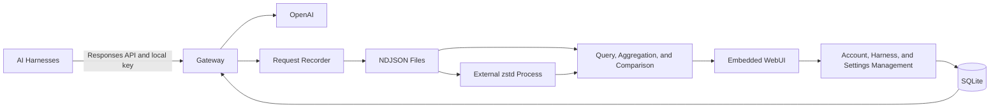

# Gyemoim: Local LLM Gateway

Status: Initial design with confirmed product decisions. Implementation has not started.

## Purpose

Gyemoim is a local LLM gateway that centralizes provider authentication and records requests from multiple AI harnesses. Users connect provider accounts through a WebUI, then configure their harnesses to send inference requests through the gateway.

The service has four primary goals:

1. Authenticate with providers once instead of authenticating each harness separately.
2. Attribute requests and token usage to individual harnesses, and investigate context growth, repeated inputs, and prompt cache misses.
3. Provide evidence for debugging provider latency, gateway delays, and harness behavior.
4. Preserve request history as data for analyzing the user's usage patterns.

## Agreed First Version

- Implement the service in Go and support Linux and macOS.
- Ship a single executable with an embedded WebUI.
- Start with no configuration file or database setup required.
- Listen on `127.0.0.1:9092` by default; support `--port` to change the port.
- Implement OpenAI OAuth first, using Sign in with ChatGPT for eligible Responses API requests.
- Expose the OpenAI Responses API format to harnesses.
- Make pi agent the first supported harness. Implement the provider-supported Responses API contract rather than a pi-specific subset; Codex support is not a first-version requirement.
- Issue a separate local API key for each harness. Provider authentication remains centralized.
- Aggregate statistics by the gateway-issued harness identity and the provider account used for each request.
- Record prompts, responses, tool definitions, and tool results by default, excluding authentication credentials.
- Preserve all request content without per-harness recording exclusions or automatic body masking.
- Block new inference requests when request recording is unavailable; do not offer an unlogged bypass.
- Allow immediate access to the local WebUI without an administrator login or initial approval flow.
- Apply account disconnection and harness key revocation to new requests without explicitly interrupting requests already in progress.
- Store configuration and credentials in SQLite; store request history in NDJSON files.
- Rotate logs and compress closed files by spawning the external `zstd` executable.
- Retain request history indefinitely by default. Provide storage visibility and manual deletion through the WebUI.

## Architecture

The request path handles harness identification, account selection, provider authentication, request validation, streaming, cancellation, timing, and recording. Background work handles compression and history analysis.

Provider-specific authentication, request constraints, and model catalog conversion belong in the provider layer so that additional providers can be introduced without changing harness identity or storage behavior.

## WebUI and Feature List

| Page | Feature | Behavior |
| --- | --- | --- |
| Overview | Usage dashboard | Attribute requests to gateway-issued harness identities and the provider accounts actually used; filter by time and model; show request counts and input, output, cached, and reasoning tokens. |
| Overview | Performance and error summary | Show first-response latency, total duration, failure and cancellation rates, and slow requests. |
| Providers | OpenAI OAuth connections | Sign in, add accounts, inspect connection status, reauthenticate, and disconnect. |
| Providers | Token lifecycle | Refresh automatically, serialize refreshes per session, and atomically persist replacement credentials. |
| Providers | Models and permissions | Show account-specific models and ChatGPT plan authorization; link to provider usage management. |
| Harnesses | Harness registration | Assign a name, issue or revoke a local key, and select a provider account. |
| Harnesses | Connection instructions | Provide Base URL and local key setup examples for pi agent over HTTP Responses. |
| Requests | Request browser | Filter by time, harness, account, model, and status; display requests in progress. |
| Requests | Request details | Inspect the incoming request, effective upstream request, response events, tool calls, errors, and usage. |
| Requests | Timing timeline | Show authentication preparation, connection, transmission, first event, first output, stream termination, and downstream delivery. |
| Requests | Request comparison | Compare instructions, tools, messages, and model settings; expose context growth and repeated requests. |
| Requests | Cache analysis | Show reported cached tokens, reuse ratios, changes to the input prefix, and differences in cache-related settings. |
| Requests | Export | Download selected request records as NDJSON and usage summaries as CSV. |
| Storage | Retention and compression | Show raw and compressed sizes, pending or failed compression, retention settings, and manual deletion by date range. |
| Storage | Service status | Show data paths, SQLite and log write status, and whether `zstd` is available. |

## Harness Interface and Routing

The first version exposes:

- `POST /v1/responses`
- `GET /v1/models`

The gateway identifies each harness using its local bearer key and selects the provider account assigned to that harness. It replaces the local credential with the provider credential for upstream requests. Provider access and refresh tokens are never supplied to harnesses.

Local keys are stored as hashes in SQLite. Keys can be issued and revoked from the WebUI.

pi agent is the first integration target. Preserve Responses API behavior across supported clients rather than introducing pi-specific request semantics. OpenAI OAuth capability restrictions still apply and must produce clear errors. The pi version, configuration, and integration acceptance cases will be established during implementation.

When admitting a request, retain its harness identity and selected provider account for attribution and routing. Subsequent routing changes, key revocation, or account disconnection affect new requests. The gateway does not explicitly cancel admitted requests in response to these administrative actions.

The model endpoint converts the account-specific provider catalog into the standard OpenAI model-list response expected by clients.

Every inference request receives a gateway request ID, returned through `X-Request-ID`. Provider request IDs are recorded separately.

First-version statistics are grouped by gateway-issued harness identity and provider account. Session and project attribution are deferred to later extensions. The gateway does not treat a harness identity as proof that requests belong to one conversation.

## OpenAI OAuth and Request Handling

Use the official Sign in with ChatGPT flow described in [Registration and sign-in](https://developers.openai.com/siwc/token-sharing-open-source/sign-in).

- Use the same listener for the WebUI and the OAuth callback: `http://127.0.0.1:<port>/auth/callback`.
- Start initial registration with `client_id=dynamic_agent_client` and retain the actual issued client ID for later authorization and token exchange.
- Generate and persist a stable host ID.
- Validate state, PKCE, nonce, the ID token, and granted scopes.
- Keep account registrations and credential sets separate, including accounts with identical email addresses.
- Serialize refreshes for each session and atomically save the access token and replacement refresh token together.
- Support reauthentication and connection removal through the WebUI.

Credential renewal and disconnection behavior follow [Accounts and sessions](https://developers.openai.com/siwc/token-sharing-open-source/profiles-and-sessions).

Inference uses the public OpenAI Responses endpoint. Upstream HTTP requests use `stream:true` and `store:false`. For a nonstreaming client request, the gateway collects the completed upstream SSE response and returns JSON. For a streaming request, it forwards SSE to the client.

The provider layer validates capabilities and records request normalization. Apart from the explicitly documented streaming and storage adaptations, unsupported fields, tools, or conversation-state requests return clear errors rather than being silently removed or changed. The first version does not provide a selectable compatibility mode. HTTP requests must include the necessary conversation history rather than depending on persistent upstream response state.

Propagate client cancellation upstream. Distinguish successful completion, failure, incomplete output, and interrupted streams. The first version does not automatically retry inference requests.

These constraints are based on [Models and inference](https://developers.openai.com/siwc/token-sharing-open-source/models-and-inference) and [Preview limitations](https://developers.openai.com/siwc/token-sharing-open-source/preview-limitations). Recheck the official requirements when implementing the provider adapter because this integration is a preview.

## Observability and Analysis

### Usage Accounting

Use token counts reported by the provider. Display cached input tokens and reasoning output tokens as components of input and output usage rather than adding them again to totals. If a request ends without reported usage, display it as unknown rather than zero.

Preserve the incoming request and the effective upstream request so that gateway normalization is visible during debugging.

### Latency Analysis

Record the stages observable at the gateway, including authentication preparation, connection establishment, request transmission, first upstream event, first output, stream completion, and downstream delivery.

These measurements help locate delays but do not independently prove a provider or harness bug. Time spent executing local tools or preparing the next harness request requires harness-side records or additional instrumentation. First-version attribution is limited to the gateway-issued harness identity and provider account; deeper session correlation is a later extension.

### Cache Analysis

Show actual cached-token usage alongside differences between related requests. Compare the input prefix, instructions, tool definitions and ordering, model, and relevant settings.

Report observed changes as candidate explanations for missed reuse. Do not claim certainty about provider-internal routing, hidden context, or cache expiration when those facts are unavailable.

Use the official [Prompt caching](https://developers.openai.com/api/docs/guides/prompt-caching) documentation as the basis for comparison behavior. Cache details vary by model and provider.

### Pattern Analysis Data

The first version provides history browsing, basic aggregation, request comparison, and exports. This creates a dataset for later analysis of repeated requests, growing context, large tool outputs, and usage patterns. Automated LLM-based interpretation is a later extension.

## Storage and Local Access

### SQLite

Store provider accounts, credentials, issued client IDs, the host ID, harness registrations, local key hashes, routing assignments, and storage settings in SQLite.

Create the application data directory automatically. Apply owner-only directory and file permissions. The loopback WebUI opens directly without an administrator login, password, or initial approval step. Protect WebUI mutations with Origin and CSRF validation; these protections must not introduce an administrator sign-in flow.

Request bodies and usage history are stored in log files rather than SQLite. In-memory aggregates are disposable and can be rebuilt from the logs.

### NDJSON Request History

Record request-start, upstream-transmission, response-event, and request-end records correlated by gateway request ID. Include schema versions and timestamps.

Record all prompts, responses, tool definitions, and tool results without per-harness exclusions or automatic content masking. Exclude gateway-managed authentication fields, including authorization headers, local keys, OAuth credentials, and authentication URLs containing token hints. Arbitrary content supplied inside prompts or tool results is preserved, so credential exclusion is not a guarantee that bodies contain no user-supplied secrets.

Keep partial request history when a stream fails or is interrupted. A completed HTTP connection alone does not establish successful inference.

If request recording becomes unavailable, including because the disk is full, reject new inference requests with an explicit `503` recording-unavailable error before calling the provider. There is no mode that bypasses recording. Keep the WebUI available to inspect and resolve the storage problem. Requests already in progress are not explicitly interrupted by this admission policy; any recording loss affecting them must be reported.

### Rotation and Compression

- Rotate a file at 64 MiB or after one hour.
- Compress only closed files.
- Check for compression work once per minute.
- Invoke the external `zstd` executable; do not embed a zstd library.
- Write compressed output to a temporary file, complete publication under the final filename, and only then remove the source NDJSON file.
- Keep the source file when compression fails.
- If `zstd` is unavailable, continue recording NDJSON and display compression as pending or unavailable.
- Read compressed history through an external `zstd -dc` process.
- Preserve records indefinitely by default; support storage inspection and manual deletion by date range.

## Implementation Sequence

1. Runtime, embedded WebUI, automatic data-directory creation, and SQLite setup.
2. OpenAI OAuth registration, credential persistence, refresh, and account management.
3. Harness registration, local keys, account routing, model listing, and Responses forwarding.
4. Request event recording, streaming status, cancellation, and timing instrumentation.
5. History browsing, usage aggregation, request comparison, cache analysis, and export.
6. File rotation, external compression, compressed-history reading, and storage management.

## Acceptance Criteria

- On a fresh Linux or macOS installation, the executable starts and serves the WebUI without configuration beyond an optional port.
- Two harnesses using different local keys can share one provider connection while their requests and usage remain independently attributable.
- pi agent can connect using the documented Responses configuration, and supported Responses behavior is preserved without pi-specific API semantics.
- Unsupported request capabilities produce clear errors instead of silent compatibility transformations.
- Statistics preserve the gateway-issued harness identity and provider account used when each request was admitted.
- Restart, concurrent refresh, missing authorization scopes, and reauthentication do not mix credential sets or account registrations.
- Tool calls, normal completion, stream errors, incomplete responses, cancellation, and disconnection are reflected consistently in client behavior and logs.
- Request comparison exposes changes to instructions, tools, and messages and preserves unknown usage or timing information.
- Restart, rotation, and compression failure leave existing history readable.
- Missing `zstd` does not prevent startup or NDJSON recording.
- When recording is unavailable, new inference requests are rejected before provider invocation and the management UI remains accessible.
- The local WebUI is immediately accessible without an administrator login or initial approval.
- Key revocation and account disconnection prevent new requests without gateway-initiated cancellation of admitted requests.
- Gateway-managed authentication fields do not appear in request logs or exports; arbitrary prompt and tool content remains intact.

## Later Extensions

Extend in this order:

1. OpenAI API key authentication.
2. Claude and z.ai API key connections.
3. Chat Completions and Claude Messages protocol adapters.
4. Session/project attribution, harness-side trace correlation, and deeper pattern analysis.

Add OAuth for another provider only after confirming its officially supported integration flow and inference permissions.
